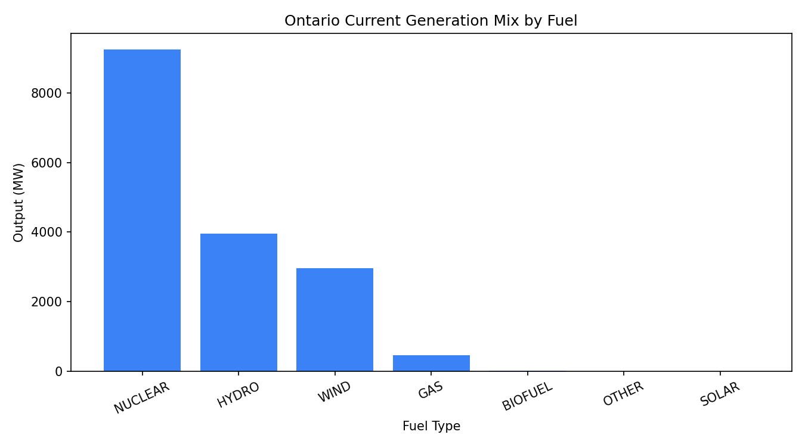
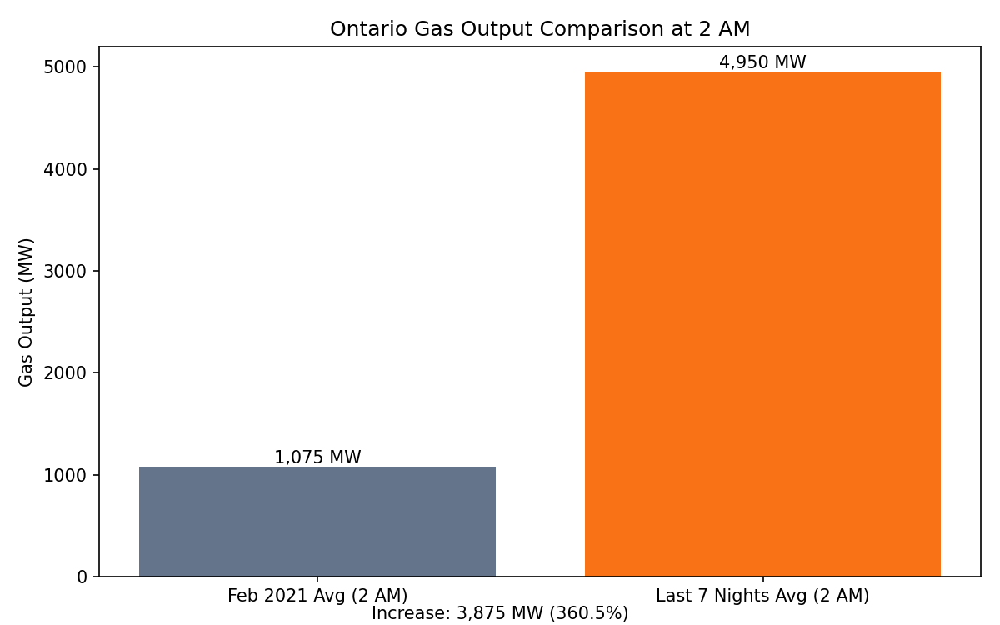

# Ontario Grid Analyzer and Clean Battery Simulator

## Goal: 

To create a program that scrapes data from Ontario's electricity grid to analyze the makeup of the types of energy used to power the province over the last hour, and use that data to operate a virtual battery controller simulation that charges based on whether or not the grid is using more or less fossil fuels than average. 

In addition to that, to use the same logic to capture the gas output of the grid from both the last 7 nights, and every night in February 2021, at 2 AM, and compare them to see the impact of new grid users like AI datacenters (this comparison is done in the Data Comparison section). Finally, to visualize both the makeup of the Ontario grid energy mix, and the February 2021 to last 7 nights comparison.

## Technical Specifications:

I used Python for scraping data from the ISEO (Ontario's electricity grid operator) website, and C++ for handling the logic of the battery and the main file that uses the Python scraper to determine whether or not the battery should be charged. I used the pandas library to handle the data scraped from the IESO website. I also used matplotlib for visualization, generating the shown images below.

## Data Comparison:

In the last-night-gen-gen.py and audit-history.py files, I compare the gas output of the Ontario electricity grid at 2 AM in February 2021, and now (by using the last 7 nights) by scraping the gas generator output data for all those dates from the IESO website. By doing this, I was able to find out that the average gas output in February 2021 in Ontario was 1,074.96 MW. Meanwhile, the average gas output over the last 7 nights (running the program on February 26, 2026) was 4,371.00 MW. I believe this increase is partly a result of a natural increase in usage of the electricity grid over time, but can also be attributed to the increase of data centers that run 24/7. The main increase in these data centers is caused by the increasing usage of artificial intelligence and the electricity needed to power that usage. In my opinion, this shows that the increasing load on the electricity grid caused by usage of artificial intelligence is an issue impacting the environment (due to the increased usage of fossil fuels requed) that requires serious efforts to resolve.

Below are the visualizations for the Ontario grid generation mix at 3:50 AM, March 8, 2026, and the visualization for the comparison of gas output I talk about above.

## Ontario Grid Generation Mix

## Gas Output: Then vs Now

## Battery Logic

The logic for the battery is quite simple. A battery object is defined as having a given capacity, initial charge, efficiency, and max power for charging, in the battery_sim.c file. In the main.py file, a battery is then created using the .dll library for the .c file. It has an capacity of 10MWh, no initial charge, 90% efficiency, and a max power of 2MW.

The Ontario grid makeup at the moment is then analyzed. If the current gas output of the Ontario energy grid as a percentage of the total output is below 16.6% (the average for Ontario), the grid is considered clean, and the battery is charged with a speed of 2 MW (though the efficiency is 90%, so 2 * 0.9 = 1.8MW). If the percentage is 16.6% or above, the grid is considered dirty, so the battery does not charge to make sure our battery uses mostly clean energy.

## Potential Uses:  

This program is quite basic, but its overall function (analyzing the energy grid and using that to simulate a battery that only charged if the grid is operating off of more clean energy than usual) could be expanded to much larger usecases. For example, a transit system with a fleet of electric buses could be made even more efficient and environmentally conscious by monitoring when the grid is cleanest, and then charging the buses accordingly. This would usually be around late night (past 12 AM) when energy demand from homes is lowest and fossil fuel usage is less than normal.

## Sources for data used:

For the carbon emission values (indirect, taking into account supply chain) of different energy sources, I used this website as my source: [Greenhouse Gas Emissions of Energy Sources](https://www.dl1.en-us.nina.az/Life-cycle_greenhouse-gas_emissions_of_energy_sources.html?utm_source=chatgpt.com)

For my benchmark to decide when the grid is dirty, I used Ontario's 2024 electricity mix data: 

[2024 Ontario Energy Supply Mix](https://www.oeb.ca/sites/default/files/2024-supply-mix-data-update.pdf)

As can be seen in the file, 16.6% of the total electricity used came from fossil fuels, which is why I used it to decide if the grid is dirty or clean.

The URLs for the websites where data is taken from, are linked below:
[IESO Current Grid Output](https://reports-public.ieso.ca/public/GenOutputCapability/PUB_GenOutputCapability.xml)
[Ieso Grid Output for Month of February 2021](https://reports-public.ieso.ca/public/GenOutputCapabilityMonth/PUB_GenOutputCapabilityMonth_202102.csv)
